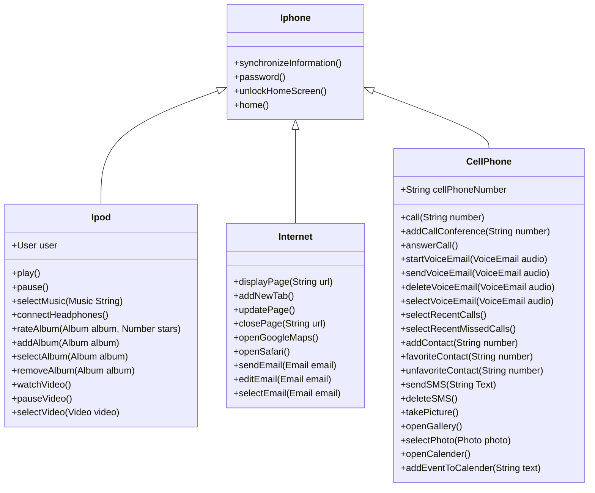

# Desafio de Projeto [DIO](https://www.dio.me/)
## Modelando o iPhone com UML: Funções de Músicas, Chamadas e Internet
##  [BootCamp da GFT - Desenvolvimento Java com IA](https://web.dio.me/track/coding-future-gft-desenvolvimento-java-com-ia)

## Modelando o iPhone com UML

